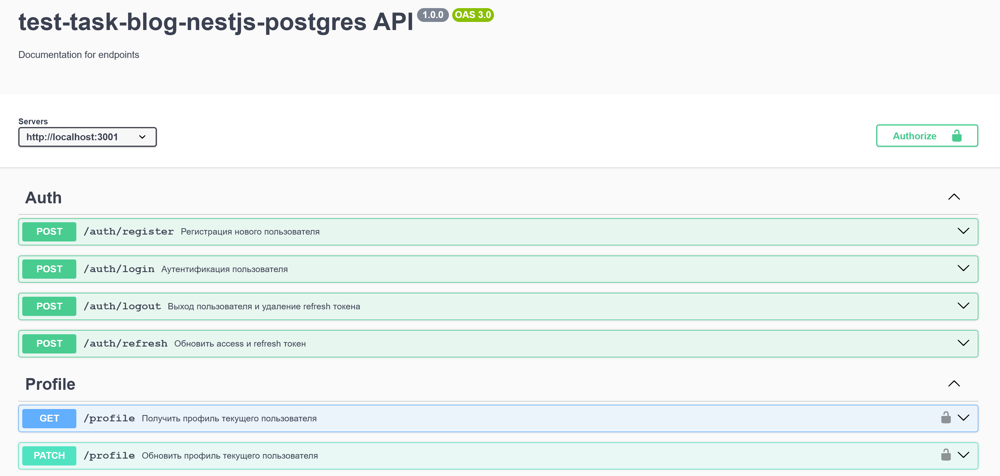

## Тестовое задание🛡️ Backend API — NestJS + PostgreSQL + JWT

> ℹ️ Полное техническое задание доступно в корне проекта в файле  
> **Техническое задание.pdf**

**Тестовое задание** "Backend API блога" для работы с профилем пользователя и его постами, написанный на NestJS с использованием PostgreSQL и TypeORM.  
Проект реализует:
- REST API Auth, Posts, Profile
- OpenAPI-документацию для REST API
- Аутентификация по JWT (access + refresh)
- Fingerprint-защита refresh-токенов
- Хранение изображений в файловой системе
- Хранение данных в БД Postgres
- Валидация входящих данных схемами zod
- Валидация расширений изборажений по File Magic Numbers
- Контейнеризация через Docker Compose

### 🌐 Связанный фронтенд
Фронтенд для этого тестового задания доступен по ссылке:  
👉 [https://github.com/ziaq/test-task-blog-react-shadcn](https://github.com/ziaq/test-task-blog-react-shadcn)

---

### 🛠️ Технологии

- **NestJS** — основной backend-фреймворк
- **PostgreSQL** — база данных
- **TypeORM** — ORM
- **JWT** — аутентификация
- **Multer** — загрузка изображений
- **Zod** — валидация входных данных
- **OpenAPI** - документация
- **Docker / Docker Compose** — контейнеризация приложения и базы данных

---

## 🔧 Документация к API

### 📄 OpenAPI (Swagger)



Полная спецификация API доступна:

- 📁 **Файл OpenAPI**: `docs/openapi.yaml`
- 🌐 **Интерактивная документация (Swagger UI)**:  
  доступна по адресу: `<OPENAPI_URL>/api` после запуска проекта  
  (где `<OPENAPI_URL>` берется из `.env``)

### 🖼 Получение изображений

- `GET /uploads/avatar/:filename` — получение аватара пользователя по имени файла  
  Требуется параметр URL:
  - `filename` — имя файла изображения пользователя (например, `avatar.jpg`)

- `GET /uploads/post-images/:filename` — получение изображения, прикрепленного к посту по имени файла  
  Требуется параметр URL:
  - `filename` — имя файла изображения поста (например, `image1.jpg`)
---

## 🚀 Запуск проекта

### 1. Клонировать репозиторий

```bash
git clone https://github.com/your-org/nest-auth-api.git
cd nest-auth-api
```
### 2. Создать .env файл
В корне проекта создай файл .env со следующим содержимым:
```env
NODE_ENV=development
SERVER_IP=0.0.0.0
SERVER_PORT=3001
OPENAPI_URL=http://localhost:3001
CLIENT_URL=http://localhost:5171

POSTGRES_HOST=postgres
POSTGRES_PORT=5432
POSTGRES_USERNAME=postgres
POSTGRES_PASSWORD=123456
POSTGRES_DB=postgres

JWT_ACCESS_SECRET=secret_access_token_key_123!@#
JWT_REFRESH_SECRET=even_more_secret_refresh_token_key_456!@#
```
### 3. Запустить проект через docker-compose
В терминале перейди в корень проекта и выполни команды:
1. Собрать образы
```bash
docker-compose build
```
2. Запустить проект
```bash
docker-compose up -d
```

Это поднимет:

- ✅ **API-сервер NestJS** — доступен по адресу: [`http://localhost:3001`](http://localhost:3001)  
  ℹ️ Интерактивная документация OpenAPI (Swagger) будет доступна по адресу: [`http://localhost:3001/api`](http://localhost:3001/api)

- ✅ **PostgreSQL** — база данных будет доступна локально по адресу:  
  `localhost:5432`  
  ℹ️ Логин, пароль, имя базы, а также другие настройки берутся из файла `.env`